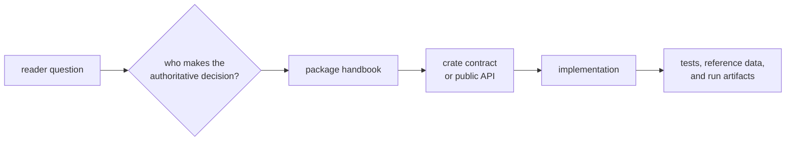
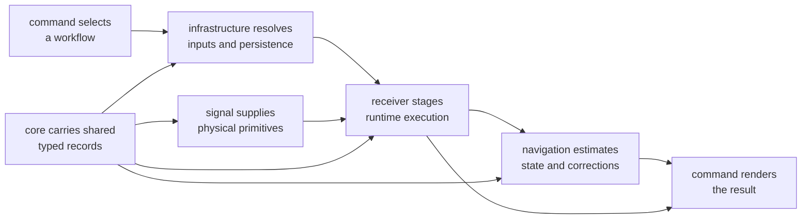

# GNSS Workspace Handbook

Use this handbook to find the package that owns a GNSS behavior and the
evidence needed to trust it. The workspace separates operator commands, shared
meaning, persisted evidence, navigation science, receiver execution, reusable
signal processing, and repository maintenance so that each claim has a clear
owner.

This page is a map, not an API reference or a scientific authority. Once you
identify the owner, continue in that package's handbook, crate documentation,
source, and tests.

<!-- bijux-gnss-badges:generated:start -->

<!-- bijux-gnss-badges:generated:end -->

## Find The Owner

| question | owning handbook | strongest starting evidence |
| --- | --- | --- |
| What does an operator command accept, execute, or report? | [Command workflows](bijux-gnss/index.md) | [command contracts](https://github.com/bijux/bijux-gnss/blob/main/crates/bijux-gnss/docs/COMMANDS.md) and [workflow implementation](https://github.com/bijux/bijux-gnss/tree/main/crates/bijux-gnss/src/cli) |
| What do shared identities, units, times, diagnostics, and artifact envelopes mean? | [Shared GNSS contracts](bijux-gnss-core/index.md) | [core contracts](https://github.com/bijux/bijux-gnss/blob/main/crates/bijux-gnss-core/docs/CONTRACTS.md) and [public facade](https://github.com/bijux/bijux-gnss/blob/main/crates/bijux-gnss-core/src/api.rs) |
| How are datasets, run identities, overrides, and persisted evidence handled? | [Repository infrastructure](bijux-gnss-infra/index.md) | [infrastructure contracts](https://github.com/bijux/bijux-gnss/blob/main/crates/bijux-gnss-infra/docs/CONTRACTS.md) and [run layout](https://github.com/bijux/bijux-gnss/blob/main/crates/bijux-gnss-infra/docs/RUN_LAYOUT.md) |
| Which parser, orbit model, correction, or estimator owns a navigation result? | [Navigation science](bijux-gnss-nav/index.md) | [navigation contracts](https://github.com/bijux/bijux-gnss/blob/main/crates/bijux-gnss-nav/docs/CONTRACTS.md) and [navigation test evidence](https://github.com/bijux/bijux-gnss/blob/main/crates/bijux-gnss-nav/docs/TESTS.md) |
| How are acquisition, tracking, observations, and runtime validation staged? | [Receiver execution](bijux-gnss-receiver/index.md) | [pipeline contract](https://github.com/bijux/bijux-gnss/blob/main/crates/bijux-gnss-receiver/docs/PIPELINE.md) and [receiver tests](https://github.com/bijux/bijux-gnss/blob/main/crates/bijux-gnss-receiver/docs/TESTS.md) |
| Which signal identities, code families, sample contracts, and DSP primitives are reusable? | [Signal processing](bijux-gnss-signal/index.md) | [signal architecture](https://github.com/bijux/bijux-gnss/blob/main/crates/bijux-gnss-signal/docs/ARCHITECTURE.md) and [signal tests](https://github.com/bijux/bijux-gnss/blob/main/crates/bijux-gnss-signal/docs/TESTS.md) |
| Which typed command validates repository governance or benchmark evidence? | [Maintainer tooling](bijux-gnss-dev/index.md) | [maintainer commands](https://github.com/bijux/bijux-gnss/blob/main/crates/bijux-gnss-dev/docs/COMMANDS.md) and [workflow behavior](https://github.com/bijux/bijux-gnss/blob/main/crates/bijux-gnss-dev/docs/WORKFLOWS.md) |
| What changed across the workspace? | [Workspace changelog](https://github.com/bijux/bijux-gnss/blob/main/CHANGELOG.md) | the affected package changelog and commit history |

## Follow A Receiver Result

An operator-visible result often crosses several packages without transferring
ownership:

Trace a failure to the package that made the disputed decision:

- command parsing and report wording remain command concerns;
- dataset discovery, run identity, and persistence remain infrastructure
  concerns;
- acquisition, tracking, channel state, and observation production remain
  receiver concerns;
- code generation, carrier relationships, sample meaning, and reusable DSP
  remain signal concerns;
- orbit interpretation, corrections, estimators, and solution acceptance
  remain navigation concerns;
- shared records and units remain core concerns even when another package
  creates their values.

## Choose Evidence That Matches The Claim

| claim | evidence to prefer | evidence that is not enough |
| --- | --- | --- |
| a public command behaves as documented | command integration test plus rendered output | a helper unit test |
| a shared record preserves meaning | core contract, serialization proof, and consumer test | successful construction alone |
| a persisted run can be trusted | manifest, provenance, validation status, and referenced files | directory presence |
| an algorithm is scientifically correct | independent reference, truth budget, and failure diagnostics | a self-generated fixture |
| receiver state is operationally valid | per-stage evidence, lifecycle status, and bounded errors | a final position alone |
| signal behavior is physically coherent | reference vectors, properties, and continuity checks | a plausible waveform plot |
| a maintenance gate enforced policy | governed input, command exit status, and retained evidence | command execution without the required baseline or policy file |

## Supporting Evidence Packages

Two private support packages strengthen proofs without becoming product owners:

| package | responsibility | start here |
| --- | --- | --- |
| policy support | executable repository-shape and governance guardrails | [policy support guide](https://github.com/bijux/bijux-gnss/blob/main/crates/bijux-gnss-policies/README.md) |
| scientific test support | reusable truth packets, fixtures, and reference-model helpers | [scientific test support guide](https://github.com/bijux/bijux-gnss/blob/main/crates/bijux-gnss-testkit/README.md) |

Policy support checks repository conventions; it does not define GNSS product
behavior. Scientific test support helps produce or package independent
evidence; it does not make an implementation authoritative.

## Handbook Contents

The root contains one handbook for each primary owner:

- [Command workflows](bijux-gnss/index.md)
- [Shared GNSS contracts](bijux-gnss-core/index.md)
- [Repository infrastructure](bijux-gnss-infra/index.md)
- [Navigation science](bijux-gnss-nav/index.md)
- [Receiver execution](bijux-gnss-receiver/index.md)
- [Signal processing](bijux-gnss-signal/index.md)
- [Maintainer tooling](bijux-gnss-dev/index.md)

Handbook directory names match durable package ownership so published URLs,
repository links, and crate identities remain aligned. Link text should
describe the reader's question or the owning domain.

## When Sources Disagree

Documentation can lag implementation. Resolve a disagreement by inspecting:

1. the owning package's public facade and manifest;
2. the implementation that makes the disputed decision;
3. the narrowest test or independent reference that exercises it;
4. emitted artifacts and diagnostics when runtime state matters;
5. the package changelog for an intentional contract change.

Then correct the stale page. Do not preserve a handbook statement merely
because several other pages copied it.
