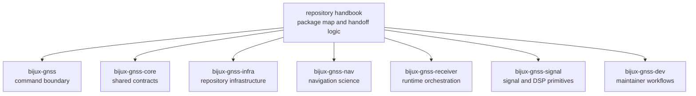

# Repository Handbook

This handbook series explains the durable package boundaries in
`bijux-telecom`. The goal is not to replace crate-local documentation. The
goal is to make the repository legible at the package level so a reader can
answer two questions quickly:

- which crate actually owns this behavior
- where should I inspect proof before I trust a strong sentence

The root discipline is restraint. The repository must not become a shadow API
manual for every crate. Once package ownership is clear, these handbooks
should hand the reader to the owning crate README, crate `docs/`, source tree,
or tests.

## What This Root Handbook Owns

- the package map for the primary GNSS product path
- cross-package routing for questions that are still package-level rather than
  file-level
- repository-level context about how command, contract, infrastructure,
  signal, receiver, navigation, and maintainer crates fit together

## What It Does Not Own

- crate-internal algorithm detail already documented under `crates/*/docs/`
- package-local implementation choices that should be proven in source and
  tests
- support crates that are not part of this seven-handbook series today

`bijux-gnss-policies` and `bijux-gnss-testkit` are still important, but they
are support packages rather than the primary product handoff chain the root
series is documenting here.

## Package Handbooks

- [01-bijux-gnss](01-bijux-gnss/) for the operator command surface and the thin
  public facade
- [02-bijux-gnss-core](02-bijux-gnss-core/) for shared GNSS contracts,
  identities, units, artifacts, and diagnostic meaning
- [03-bijux-gnss-infra](03-bijux-gnss-infra/) for dataset registry, run
  layout, provenance hashing, and repository-facing validation
- [04-bijux-gnss-nav](04-bijux-gnss-nav/) for orbit products, corrections,
  parsers, and navigation estimators
- [05-bijux-gnss-receiver](05-bijux-gnss-receiver/) for runtime composition,
  pipeline execution, ports, and receiver-side artifacts
- [06-bijux-gnss-signal](06-bijux-gnss-signal/) for signal catalogs, code
  families, raw-IQ contracts, and reusable DSP primitives
- [07-bijux-gnss-dev](07-bijux-gnss-dev/) for maintainer-only governance and
  repository health workflows

## Package Map At A Glance

| handbook | strongest question it should settle first | strongest local proof |
| --- | --- | --- |
| [01-bijux-gnss](01-bijux-gnss/) | how does the operator-facing command surface route work into lower-level crates | `crates/bijux-gnss/src/cli`, `crates/bijux-gnss/docs/` |
| [02-bijux-gnss-core](02-bijux-gnss-core/) | what shared record, identifier, unit, or artifact meaning is canonical | `crates/bijux-gnss-core/src/`, `crates/bijux-gnss-core/docs/` |
| [03-bijux-gnss-infra](03-bijux-gnss-infra/) | how do datasets, run identity, overrides, and persisted evidence work | `crates/bijux-gnss-infra/src/`, `crates/bijux-gnss-infra/docs/` |
| [04-bijux-gnss-nav](04-bijux-gnss-nav/) | which navigation models, formats, corrections, and estimators are claimed | `crates/bijux-gnss-nav/src/`, `crates/bijux-gnss-nav/docs/` |
| [05-bijux-gnss-receiver](05-bijux-gnss-receiver/) | how is a receiver run staged and what artifacts does it emit in memory | `crates/bijux-gnss-receiver/src/`, `crates/bijux-gnss-receiver/docs/` |
| [06-bijux-gnss-signal](06-bijux-gnss-signal/) | what signal-layer or DSP behavior is reusable product substrate | `crates/bijux-gnss-signal/src/`, `crates/bijux-gnss-signal/docs/` |
| [07-bijux-gnss-dev](07-bijux-gnss-dev/) | which repository safety and benchmark workflows are maintainer-only | `crates/bijux-gnss-dev/src/main.rs`, `crates/bijux-gnss-dev/docs/` |

## Shared Reader Routes

- Start at [01-bijux-gnss](01-bijux-gnss/) when the question begins from the
  installed binary or the top-level Rust facade.
- Start at [05-bijux-gnss-receiver](05-bijux-gnss-receiver/) when the question
  is about staged execution, runtime state, acquisition, tracking,
  observations, or receiver-side validation.
- Start at [04-bijux-gnss-nav](04-bijux-gnss-nav/) when the question is
  ephemerides, corrections, precise products, or navigation estimators.
- Start at [06-bijux-gnss-signal](06-bijux-gnss-signal/) when the question is
  code generation, sample representation, front-end filtering, or reusable DSP
  math.
- Start at [03-bijux-gnss-infra](03-bijux-gnss-infra/) when the question is
  datasets, run identity, artifacts on disk, or experiment sweep mechanics.
- Start at [02-bijux-gnss-core](02-bijux-gnss-core/) when the question is
  shared meaning that more than one higher-level crate depends on.
- Start at [07-bijux-gnss-dev](07-bijux-gnss-dev/) when the question is not
  product behavior at all, but rather repository safety, audit posture, or
  benchmark governance.

## Strongest Repository Proof Surfaces

| claim family | inspect first |
| --- | --- |
| workspace and package boundaries | `Cargo.toml`, `crates/` |
| repository-owned documentation routing | `docs/`, this handbook series, crate `README.md` files |
| command and maintainer entrypoints | `crates/bijux-gnss/src/main.rs`, `crates/bijux-gnss-dev/src/main.rs`, `Makefile` |
| data and configuration inputs | `datasets/`, `configs/`, `schemas/` |
| execution and regression evidence | crate `tests/`, repository `artifacts/`, validation commands in crate READMEs |

## Boundary Test

If the strongest proof already lives inside one crate's `src/`, crate `docs/`,
or tests, leave the repository handbook and go to that crate's handbook next.
