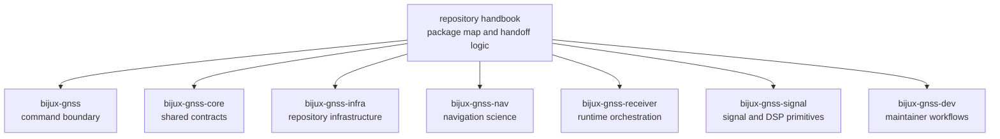

# Repository Handbook

`bijux-telecom` is a Rust GNSS workspace built around explicit package
ownership. This handbook series exists so a reader can find the package that
owns a behavior before reading implementation detail, cargo metadata, or test
evidence. The root does not replace crate-local documentation. It makes the
repository legible enough that the next proof surface is obvious.

Read this site by owned proof, not by crate popularity, workspace familiarity,
or whichever package happened to appear in the last review.

<!-- bijux-telecom-badges:generated:start -->

<!-- bijux-telecom-badges:generated:end -->

Use this site to answer four questions quickly:

- which crate actually owns this behavior
- where should I inspect proof before I trust a strong sentence
- when should I leave the repository handbook and move into crate-local docs,
  source, or tests
- when does the question belong to a support crate rather than to one of the
  seven primary handbook owners

The root discipline is restraint. The repository handbook must not become a
shadow API manual for every crate. Once package ownership is clear, it should
hand the reader to the owning crate README, crate `docs/`, source tree, test
suite, or repository evidence surface.

## Read The Repository By Ownership

| if the question is about | start here | strongest proof after the handbook |
| --- | --- | --- |
| operator commands, CLI reports, or top-level workflows | [01-bijux-gnss](01-bijux-gnss/) | `crates/bijux-gnss/src/cli`, `crates/bijux-gnss/docs/` |
| shared record meaning, IDs, units, times, or artifact envelopes | [02-bijux-gnss-core](02-bijux-gnss-core/) | `crates/bijux-gnss-core/src/`, `crates/bijux-gnss-core/docs/` |
| datasets, run identity, manifests, overrides, or persisted evidence | [03-bijux-gnss-infra](03-bijux-gnss-infra/) | `crates/bijux-gnss-infra/src/`, `crates/bijux-gnss-infra/docs/` |
| navigation products, corrections, orbit logic, or estimator behavior | [04-bijux-gnss-nav](04-bijux-gnss-nav/) | `crates/bijux-gnss-nav/src/`, `crates/bijux-gnss-nav/docs/` |
| staged receiver execution, in-memory artifacts, or runtime validation | [05-bijux-gnss-receiver](05-bijux-gnss-receiver/) | `crates/bijux-gnss-receiver/src/`, `crates/bijux-gnss-receiver/docs/` |
| signal catalogs, code families, sample contracts, or reusable DSP | [06-bijux-gnss-signal](06-bijux-gnss-signal/) | `crates/bijux-gnss-signal/src/`, `crates/bijux-gnss-signal/docs/` |
| maintainer governance, audit policy, or benchmark evidence | [07-bijux-gnss-dev](07-bijux-gnss-dev/) | `crates/bijux-gnss-dev/src/main.rs`, `crates/bijux-gnss-dev/docs/` |

## Seven-Handbook Contract

The root `docs/` tree is intentionally narrow:

- seven crate handbooks for the primary GNSS product and maintainer path
- `index.md` for repository routing
- `badges.md` for shared entry-surface badge policy

That shape is a contract, not an accident. Support crates still matter, but
they should be routed from this root page rather than growing the repository
handbook into a second crate registry.

## What This Root Handbook Owns

- the package map for the primary GNSS product path
- cross-package routing for questions that are still package-level rather than
  file-level
- repository-level context about how command, contract, infrastructure,
  signal, receiver, navigation, and maintainer crates fit together
- the shortest honest route from a root claim to the checked-in proof that can
  defend it

## What It Does Not Own

- crate-internal algorithm detail already documented under `crates/*/docs/`
- package-local implementation choices that should be proven in source and
  tests
- support crates that are not part of this seven-handbook series today
- substitute crate-local API manuals once the owning package is known

`bijux-gnss-policies` and `bijux-gnss-testkit` are still important, but they
are support packages rather than the primary product handoff chain the root
series is documenting here.

## Support Packages Outside The Seven-Handbook Chain

Two crates matter to the repository trust story even though they are not first
class handbook owners in `docs/`:

- `bijux-gnss-policies` owns executable repository guardrails. Its strongest
  proof surfaces are `crates/bijux-gnss-policies/README.md`,
  `crates/bijux-gnss-policies/docs/`, and its policy tests.
- `bijux-gnss-testkit` owns reusable scientific fixtures, truth data, and
  independent reference models. Its strongest proof surfaces are
  `crates/bijux-gnss-testkit/README.md`,
  `crates/bijux-gnss-testkit/docs/`, and test-only consumers across the
  workspace.

When a product claim depends on reference truth or repository guardrails,
leave the root series after package routing and inspect those support crates
directly.

## Package Handbooks

| handbook | strongest question it should settle first | strongest local proof |
| --- | --- | --- |
| [01-bijux-gnss](01-bijux-gnss/) | how does the operator-facing command surface route work into lower-level crates | `crates/bijux-gnss/src/cli`, `crates/bijux-gnss/docs/` |
| [02-bijux-gnss-core](02-bijux-gnss-core/) | what shared record, identifier, unit, or artifact meaning is canonical | `crates/bijux-gnss-core/src/`, `crates/bijux-gnss-core/docs/` |
| [03-bijux-gnss-infra](03-bijux-gnss-infra/) | how do datasets, run identity, overrides, and persisted evidence work | `crates/bijux-gnss-infra/src/`, `crates/bijux-gnss-infra/docs/` |
| [04-bijux-gnss-nav](04-bijux-gnss-nav/) | which navigation models, formats, corrections, and estimators are claimed | `crates/bijux-gnss-nav/src/`, `crates/bijux-gnss-nav/docs/` |
| [05-bijux-gnss-receiver](05-bijux-gnss-receiver/) | how is a receiver run staged and what artifacts does it emit in memory | `crates/bijux-gnss-receiver/src/`, `crates/bijux-gnss-receiver/docs/` |
| [06-bijux-gnss-signal](06-bijux-gnss-signal/) | what signal-layer or DSP behavior is reusable product substrate | `crates/bijux-gnss-signal/src/`, `crates/bijux-gnss-signal/docs/` |
| [07-bijux-gnss-dev](07-bijux-gnss-dev/) | which repository safety and benchmark workflows are maintainer-only | `crates/bijux-gnss-dev/src/main.rs`, `crates/bijux-gnss-dev/docs/` |

## What The Repository Takes And Produces

- takes: registered datasets, raw-IQ captures, receiver and navigation
  configuration, reference products, and reviewed maintainer policy inputs
- produces: receiver run artifacts, validation reports, persisted manifests,
  benchmark evidence, and package-level proof surfaces for the GNSS pipeline
- guarantees: explicit package ownership, typed repository evidence, and a
  durable route from public command surface to lower-level scientific owners
- does not guarantee: navigation truth beyond the checked-in proof, silent
  cross-package handoffs, or one root page that can replace crate-local docs

## Shared Reader Routes

- Start at [01-bijux-gnss](01-bijux-gnss/) when the question begins from the
  installed binary or the top-level Rust facade.
- Start at [05-bijux-gnss-receiver](05-bijux-gnss-receiver/) when the question
  is about staged execution, runtime state, acquisition, tracking,
  observations, or receiver-side validation.
- Start at [04-bijux-gnss-nav](04-bijux-gnss-nav/) when the question is
  ephemerides, corrections, precise products, or navigation estimators.
- Start at [06-bijux-gnss-signal](06-bijux-gnss-signal/) when the question is
  code generation, sample representation, front-end filtering, or reusable DSP
  math.
- Start at [03-bijux-gnss-infra](03-bijux-gnss-infra/) when the question is
  datasets, run identity, artifacts on disk, or experiment sweep mechanics.
- Start at [02-bijux-gnss-core](02-bijux-gnss-core/) when the question is
  shared meaning that more than one higher-level crate depends on.
- Start at [07-bijux-gnss-dev](07-bijux-gnss-dev/) when the question is not
  product behavior at all, but rather repository safety, audit posture, or
  benchmark governance.
- Leave the seven-handbook chain and inspect `bijux-gnss-policies` or
  `bijux-gnss-testkit` directly when the strongest claim depends on policy
  guardrails or independent scientific truth rather than on product ownership.

## Strongest Repository Proof Surfaces

| claim family | inspect first |
| --- | --- |
| workspace and package boundaries | `Cargo.toml`, `crates/` |
| repository-owned documentation routing | `docs/`, this handbook series, crate `README.md` files |
| command and maintainer entrypoints | `crates/bijux-gnss/src/main.rs`, `crates/bijux-gnss-dev/src/main.rs`, `Makefile` |
| data and configuration inputs | `datasets/`, `configs/`, `schemas/` |
| execution and regression evidence | crate `tests/`, repository `artifacts/`, validation commands in crate READMEs |

## Leave The Root Handbook When

- one crate handbook clearly owns the next sentence you need to trust
- the next step is implementation detail, public API detail, or test evidence
- the question depends on `bijux-gnss-policies` or `bijux-gnss-testkit`
  rather than on the seven product and maintainer handbooks
- you already know the owner and need crate-local proof rather than
  repository-level routing
- the only remaining disagreement is about one exact file, one test family, or
  one crate-local invariant

## Boundary Test

If the strongest proof already lives inside one crate's `src/`, crate `docs/`,
or tests, leave the repository handbook and go to that crate's handbook next.
